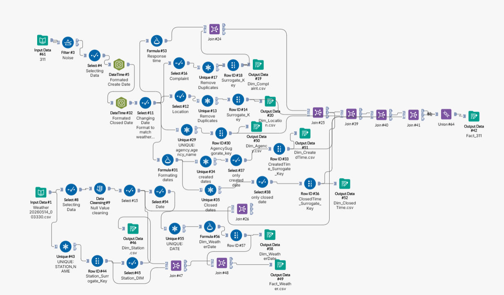
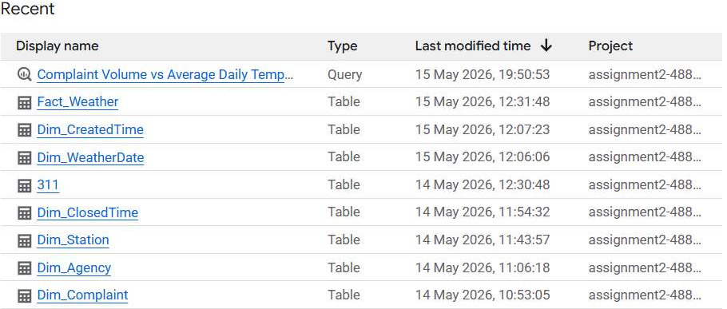
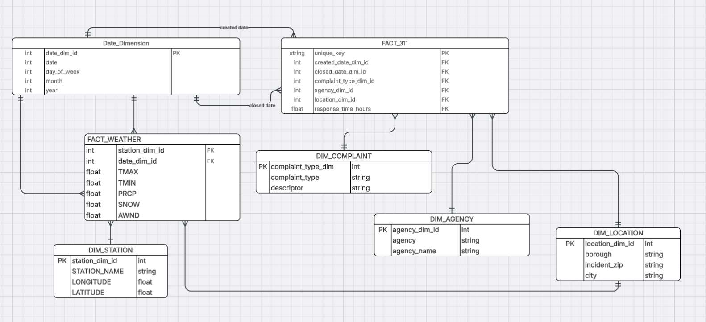
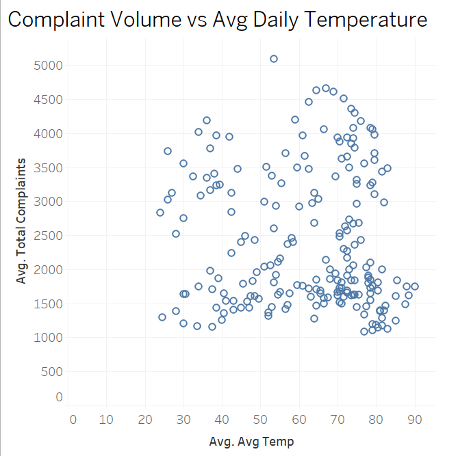
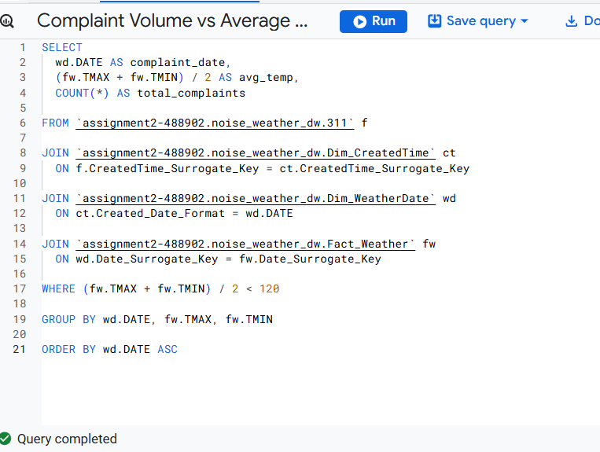

# NYC 311 Noise Complaints and Weather

This was a team project for my Data Warehousing for Analytics class (CIS 4400) at Baruch College.

**My part.** I built the integrated data marts, the ETL workflow in Alteryx, and the tables in Google BigQuery,
and I made the temperature KPI. I also worked on the project proposal and the final data model with the team.

## The question

New York City has about 8.5 million people, and noise complaints are one of the most common
"quality of life" issues people report through NYC 311. We wanted to know **if noise complaints
are affected by the weather**.

Our guess was that warm days get more people outside, which leads to more noise and more complaints.
Cold days and bad weather like snow or heavy rain should keep people inside and lead to fewer complaints.

## The data

| Source | What we used |
|---|---|
| [311 Service Requests from 2020 to Present](https://data.cityofnewyork.us/Social-Services/311-Service-Requests-from-2020-to-Present/erm2-nwe9) (NYC Open Data) | March 2020 to March 2026. Only noise complaints, including the complaint type and details (for example, Noise Commercial and Loud Talking), location, date and time, and the agency that responded (for example, NYPD) |
| [Global Historical Climatology Network Daily](https://www.ncei.noaa.gov/products/land-based-station/global-historical-climatology-network-daily) (NOAA Climate Data Online) | March 2020 to March 2026. Daily weather from NYC weather stations, including high and low temperature, rain, snow, and wind |

## How I built it

I used Alteryx for the ETL (extract, transform, load).

1. **Extract.** Pulled the raw data from NYC Open Data and NOAA Climate Data Online
2. **Transform.** Cleaned the data, made the column names and data types consistent, fixed the date formats so the two datasets could be joined, gave each record an ID, and calculated how many hours each complaint took to close
3. **Load.** Sent the tables straight from Alteryx into Google BigQuery (the full workflow ran in about 2 minutes and made 9 tables)

Then we wrote SQL in BigQuery for each KPI and made the charts in Tableau.

### Data model

The warehouse uses a star schema with two fact tables.

- `Fact_311` has one row for each noise complaint (500,000 rows), with how many hours it took to close
- `Fact_Weather` has one row for each weather station for each day, with high temp, low temp, rain, snow, and wind
- Lookup tables for Date (shared by both fact tables, so complaints and weather can be matched by day), Complaint Type, Agency, Location (borough, ZIP, city), and Station

## What we found

**1. Complaints vs. temperature (my KPI)**

This was the most interesting result. It is not a straight line. Complaints go up from cold days to
mild days, are highest around 60 to 70°F, and then go down again on the hottest days (an inverted U shape).
So warmer weather does not always mean more complaints. Very hot and very cold days both seem to
keep people inside.

The SQL for this chart is in [`complaints_vs_avg_temperature.sql`](complaints_vs_avg_temperature.sql).

**2. Complaints by borough and weather (team KPI)**

Every borough had the most complaints on hot, dry days and the fewest on snowy days.
Rainy days still had a good number of complaints, more than snowy days.

| Borough | Hot & Dry | Rainy | Snowy |
|---|---:|---:|---:|
| Bronx | 116,286 | 46,971 | 2,966 |
| Brooklyn | 84,915 | 34,193 | 1,241 |
| Manhattan | 74,646 | 30,574 | 1,109 |
| Queens | 68,461 | 27,082 | 998 |
| Staten Island | 7,468 | 2,949 | 105 |

**3. Complaints by day of the week (team KPI)**

Complaints go up as the week ends, when people go out more. Weekends had almost twice as many
complaints as Monday through Thursday.

| Mon | Tue | Wed | Thu | Fri | Sat | Sun |
|---:|---:|---:|---:|---:|---:|---:|
| 58,895 | 54,270 | 55,784 | 53,826 | 67,216 | 103,148 | 106,861 |

## Conclusion

Weather and noise complaints are related. In general there are more complaints on warmer days and
fewer on cold or bad weather days, but at the extreme ends of the temperature range complaints go
down again. The day of the week matters too. Some of this may sound obvious, but we could only say
it for sure after bringing the two datasets together and checking the numbers.

## What I learned

Picking the question and the datasets was the easy part. The hard part was actually building the
ETL and loading the warehouse correctly in Alteryx and BigQuery, since we were new to both tools.
If I did it again, I would plan the project steps more clearly from the start.

## Files in this repo

- `complaints_vs_avg_temperature.sql` is the BigQuery SQL for my KPI
- The `.png` files are the Alteryx workflow, the tables in BigQuery, the data model, my SQL query, and my chart

## Tools

Alteryx, Google BigQuery, SQL, Tableau, NYC Open Data, NOAA Climate Data Online
